---
## Front matter
lang: ru-RU
title: Презентация по первому этапу проекта
subtitle: Установка Kali Linux
author:
  - Чуева З.
institute:
  - Российский университет дружбы народов, Москва, Россия
date: 07 Марта 2026

## i18n babel
babel-lang: russian
babel-otherlangs: english

## Formatting pdf
toc: false
toc-title: Содержание
slide_level: 2
aspectratio: 169
section-titles: true
theme: metropolis
header-includes:
 - \metroset{progressbar=frametitle,sectionpage=progressbar,numbering=fraction}
---

# Докладчик

:::::::::::::: {.columns align=center}
::: {.column width="70%"}

  * Чуева Злата
  * НБИбд-01-24
  * Факультет физико-математический и естесвенных наук
  * Российский университет дружбы народов
  * [1132242459@rudn.ru](mailto:1132242459@rudn.ru)
  * <https://github.com/ZlataChueva>

:::
::::::::::::::

# Цель работы

Получение навыков по установке ОС на менеджер виртуальных машин.

# Задание

Установить дистрибутив Kali Linux.

# Выполнение лабораторной работы

Открываю приложение VirtualBox и создаю новую машину.

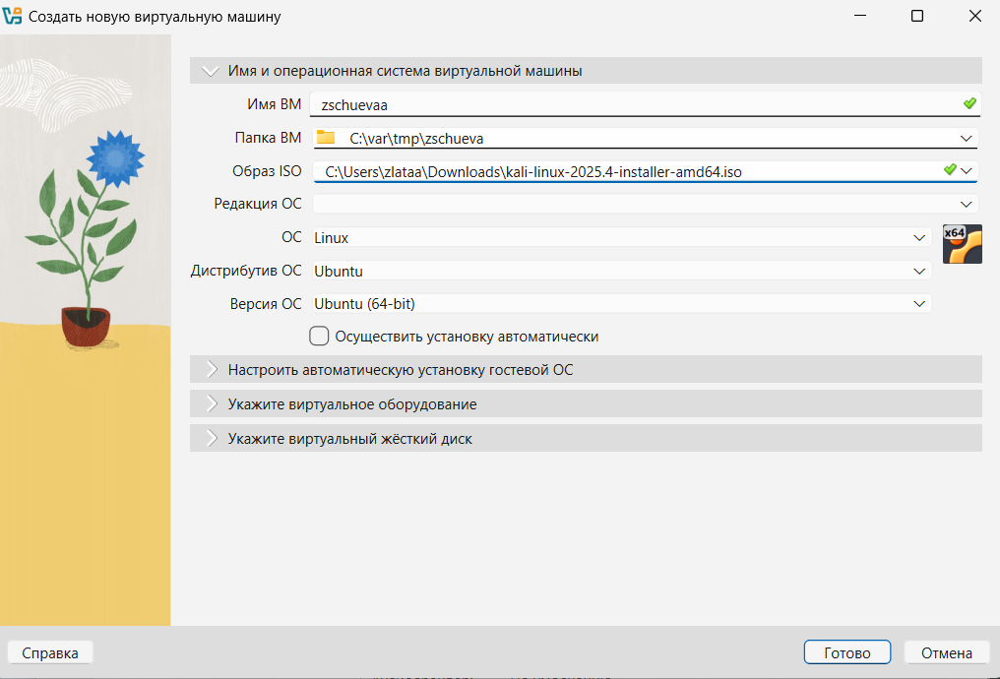{#fig:01 width=70%}

# Оперативная память

Задаю оперативную память.

{#fig:02 width=70%}

# Жесткий диск

Задаю размер жесткого диска.

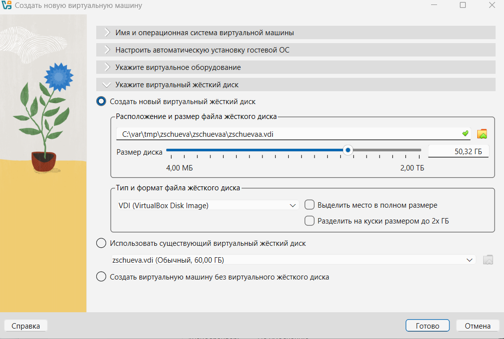{#fig:03 width=70%}

# Детали виртуальной машины

Создаю виртуальную машину. 

{#fig:004 width=70%}

# Экран установки

Запускаю систему и выбираю Graphical Install что бы начать установку. 

{#fig:05 width=70%}

# Язык установки

Выбираю язык установки.

{#fig:06 width=70%}

# Конфигурация клавиатуры

Выбираю конфигурацию клавиатуры. 

{#fig:07 width=70%}

# Имя хоста

Задаю имя хоста.

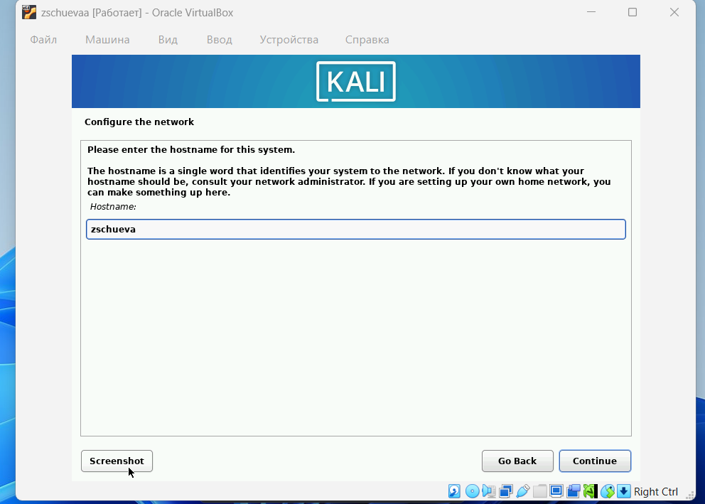{#fig:09 width=70%}

# Создание пользователя

Задаю имя пользователя и устанавливаю пароль. 

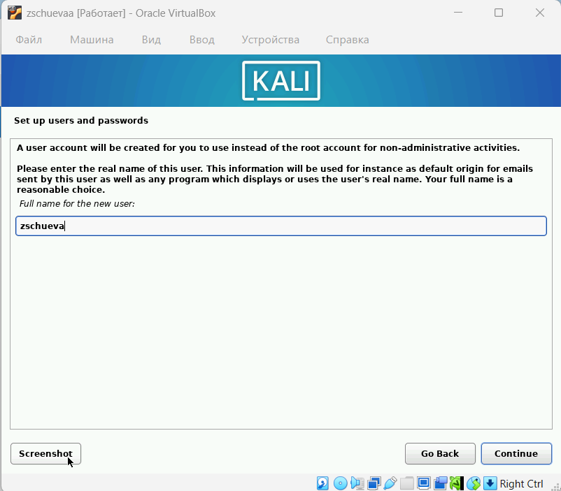{#fig:10 width=70%}

# Имя аккаунта

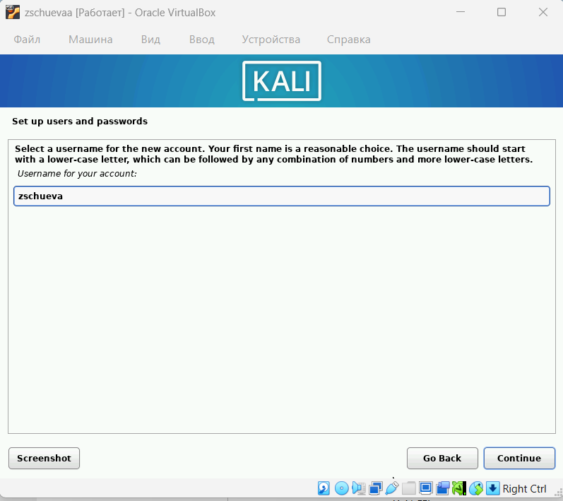{#fig:11 width=70%}

# Пароль

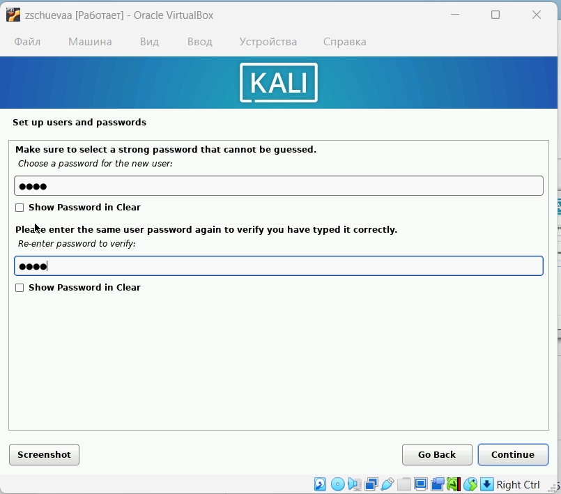{#fig:12 width=70%}

# Тип раздления диска

Выбираю тип разделения диска. 

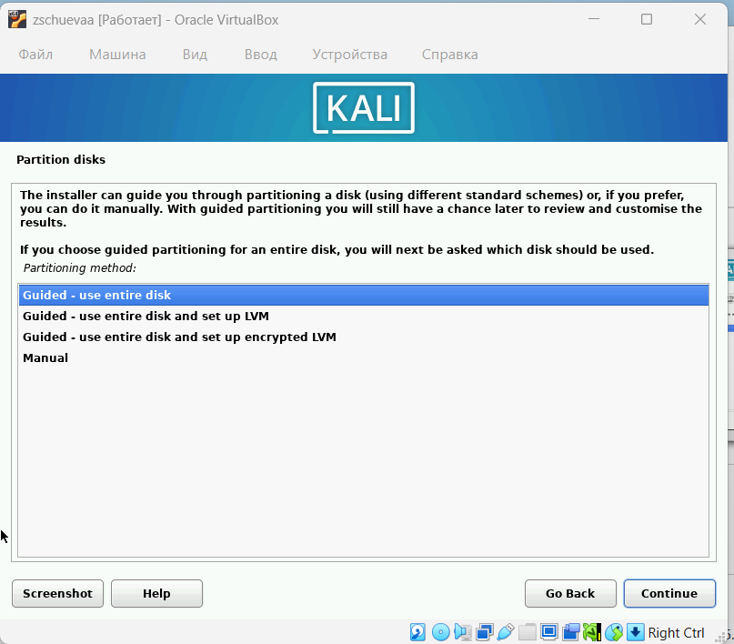{#fig:13 width=70%}

# Диск

Выбираю диск для работы.

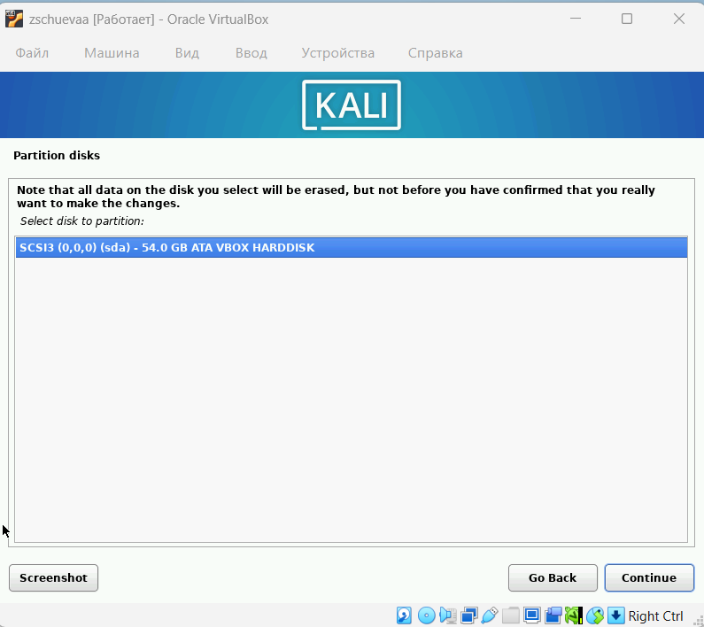{#fig:14 width=70%}

# Схема разделения

Выбираю схему разделения. 

{#fig:15 width=70%}

# Обзор

Завершаю выбор разделения и сохраняю настройки.

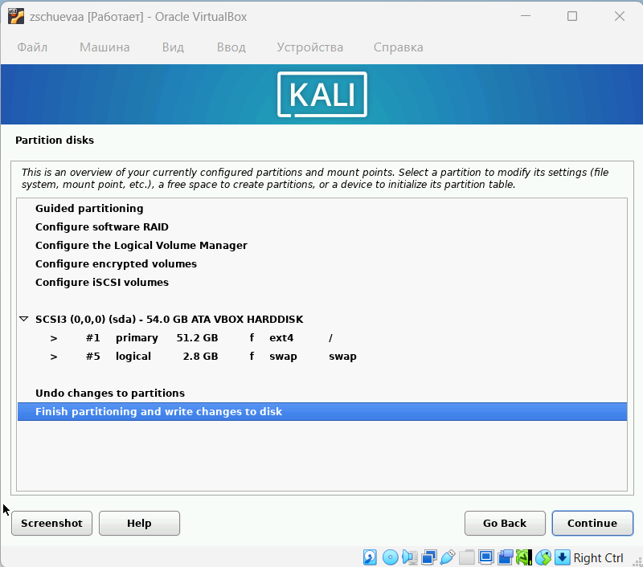{#fig:16 width=70%}

# Применение настроек

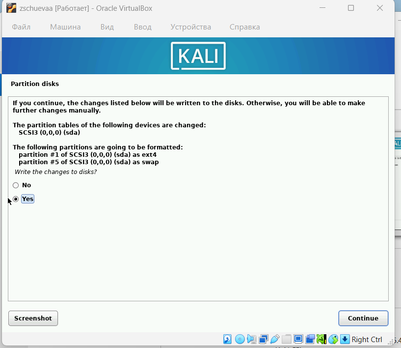{#fig:17 width=70%}

# Установка 

Начинается установка базовой системы. 

{#fig:18 width=70%}

# Среда и инструменты

Выбираю среду рабочего стола и инструменты.

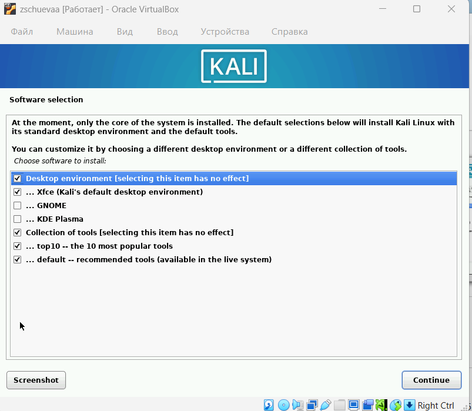{#fig:19 width=70%}

# GRUB

Устанавливаю GRUB boot loader.

{#fig:20 width=70%}

# Устройство 

Выбираю устройство для установки boot loader.

{#fig:21 width=70%}

# Завершение установки

Завершаю установку. 

{#fig:22 width=70%}

# Вход в систему

Перезагружаю систему и захожу в систему. 

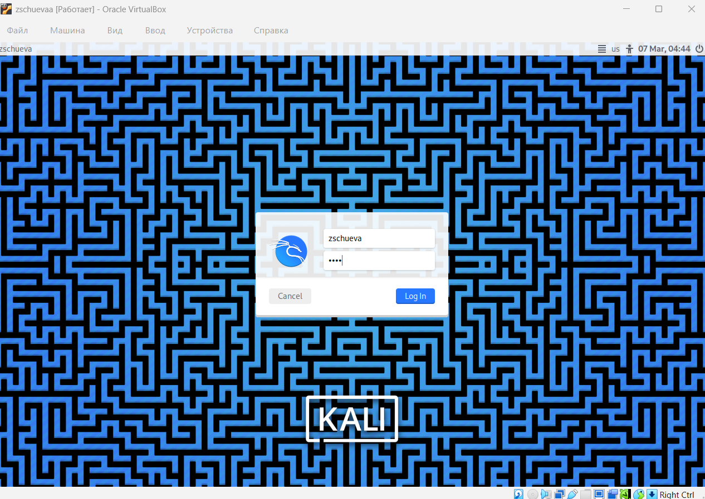{#fig:23 width=70%}

# Рабочий стол

{#fig:24 width=70%}

# Выводы

Получила навыки по установке ОС на менеджер виртуальных машин.
