---
## Front matter
title: "Отчёт по индивидуальному проекту. Этап 1"
subtitle: "Установка Kali Linux"
author: "Чуева Злата НБИбд-01-24"

## Generic otions
lang: ru-RU
toc-title: "Содержание"

## Bibliography
bibliography: bib/cite.bib
csl: pandoc/csl/gost-r-7-0-5-2008-numeric.csl

## Pdf output format
toc: true # Table of contents
toc-depth: 2
lof: true # List of figures
fontsize: 13pt
linestretch: 1.5
papersize: a4
documentclass: scrreprt
## I18n polyglossia
polyglossia-lang:
  name: russian
  options:
	- spelling=modern
	- babelshorthands=true
polyglossia-otherlangs:
  name: english
## I18n babel
babel-lang: russian
babel-otherlangs: english
## Fonts
mainfont: Times New Roman
romanfont: Times New Roman
sansfont: Times New Roman
monofont: Times New Roman
mathfont: Times New Roman
mainfontoptions: Ligatures=Common,Ligatures=TeX,Scale=0.94
romanfontoptions: Ligatures=Common,Ligatures=TeX,Scale=0.94
sansfontoptions: Ligatures=Common,Ligatures=TeX,Scale=MatchLowercase,Scale=0.94
monofontoptions: Scale=MatchLowercase,Scale=0.94,FakeStretch=0.9
mathfontoptions:
## Biblatex
biblatex: true
biblio-style: "gost-numeric"
biblatexoptions:
  - parentracker=true
  - backend=biber
  - hyperref=auto
  - language=auto
  - autolang=other*
  - citestyle=gost-numeric
## Pandoc-crossref LaTeX customization
figureTitle: "Рис."
listingTitle: "Листинг"
lofTitle: "Список иллюстраций"
lolTitle: "Листинги"
## Misc options
indent: true
header-includes:
  - \usepackage{indentfirst}
  - \usepackage{float} # keep figures where there are in the text
  - \floatplacement{figure}{H} # keep figures where there are in the text
---

# Цель работы

Получение навыков по установке ОС на менеджер виртуальных машин.

# Задание

Установить дистрибутив Kali Linux.

# Выполнение лабораторной работы

Открываю приложение VirtualBox и создаю новую машину.

{#fig:01 width=70%}

Задаю оперативную память.

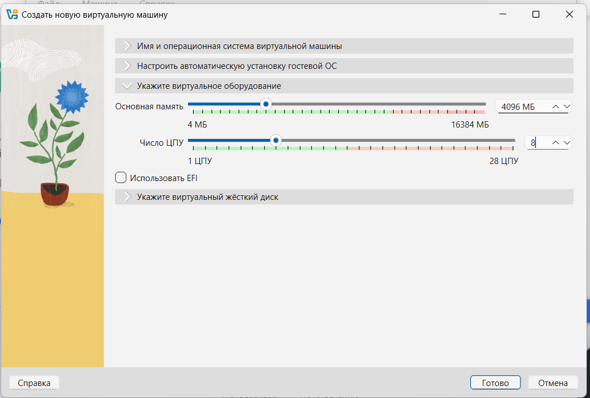{#fig:02 width=70%}

Задаю размер жесткого диска.

{#fig:03 width=70%}

Создаю виртуальную машину. 

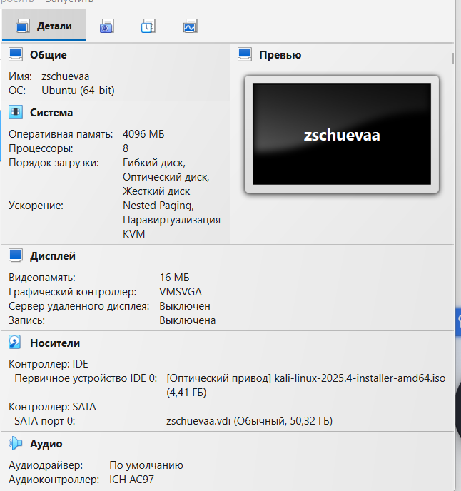{#fig:004 width=70%}

Запускаю систему и выбираю Graphical Install что бы начать установку. 

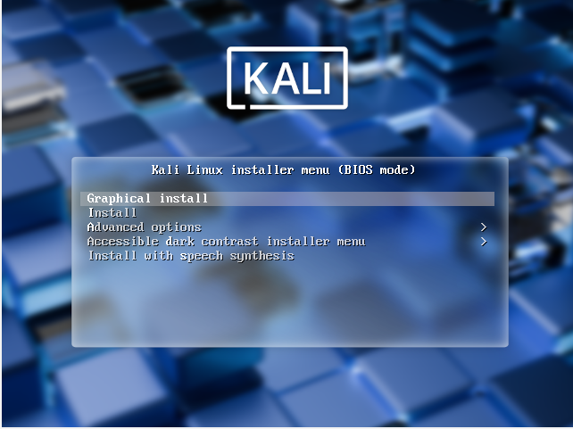{#fig:05 width=70%}

Выбираю язык установки.

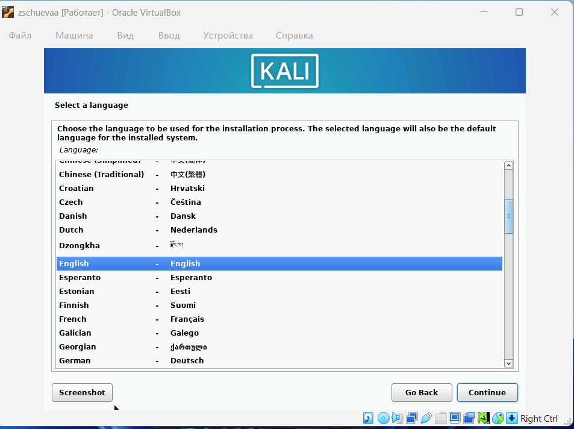{#fig:06 width=70%}

Выбираю конфигурацию клавиатуры. 

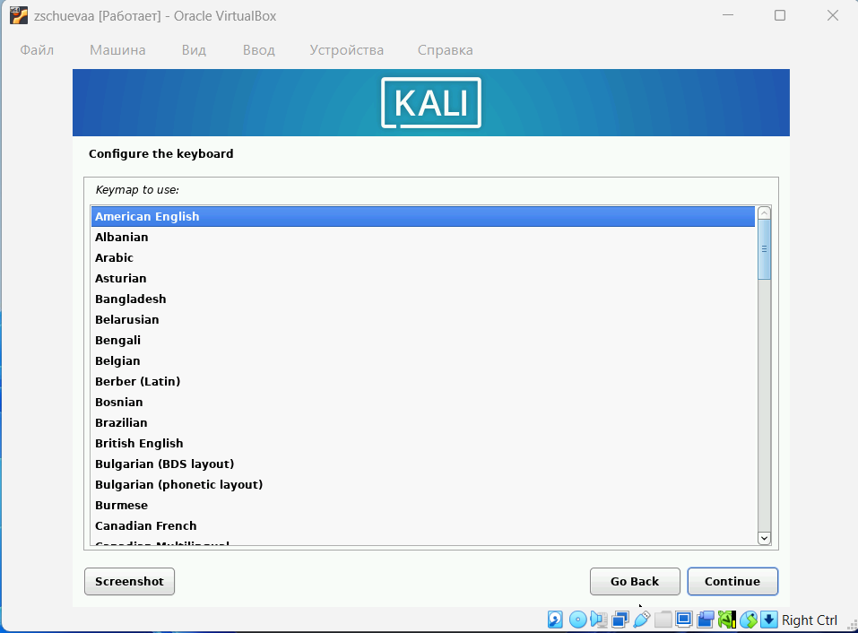{#fig:07 width=70%}

Задаю имя хоста.

{#fig:09 width=70%}

Задаю имя пользователя и устанавливаю пароль. 

{#fig:10 width=70%}

{#fig:11 width=70%}

{#fig:12 width=70%}

Выбираю тип разделения диска. 

{#fig:13 width=70%}

Выбираю диск для работы.

{#fig:14 width=70%}

Выбираю схему разделения. 

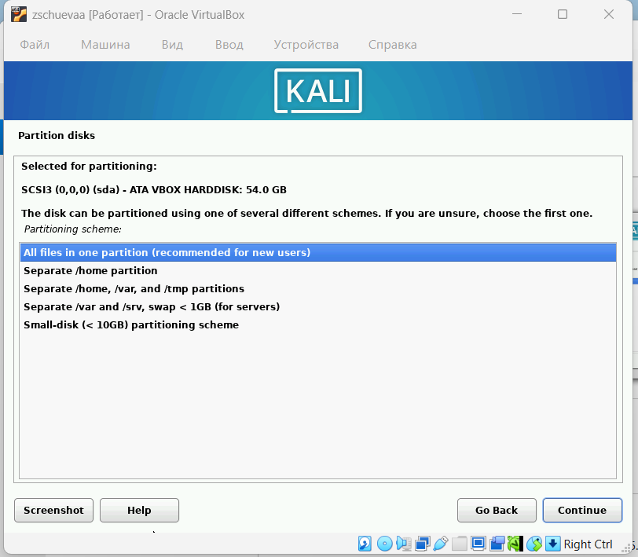{#fig:15 width=70%}

Завершаю выбор разделения и сохраняю настройки.

{#fig:16 width=70%}

{#fig:17 width=70%}

Начинается установка базовой системы. 

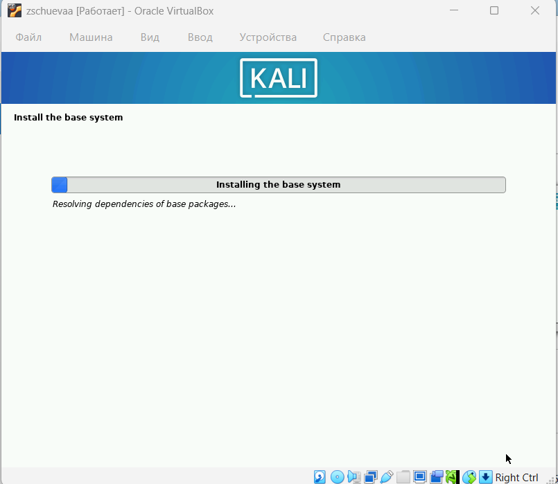{#fig:18 width=70%}

Выбираю среду рабочего стола и инструменты.

{#fig:19 width=70%}

Устанавливаю GRUB boot loader.

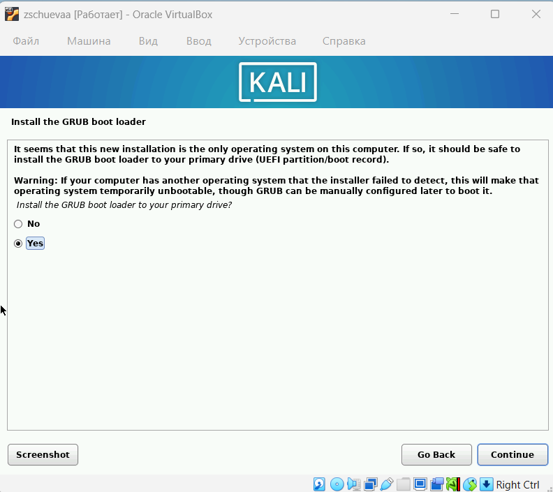{#fig:20 width=70%}

Выбираю устройство для установки boot loader.

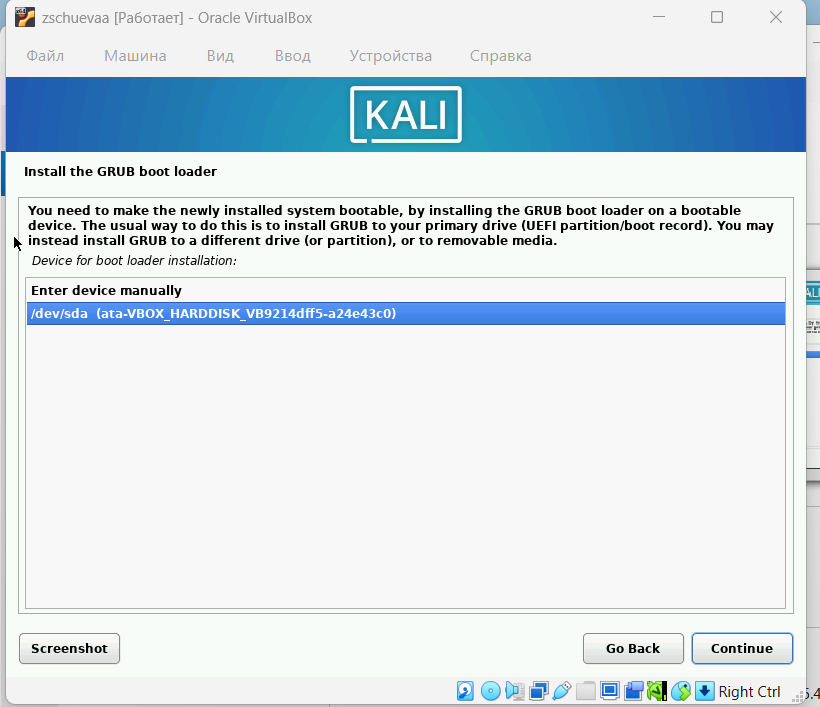{#fig:21 width=70%}

Завершаю установку. 

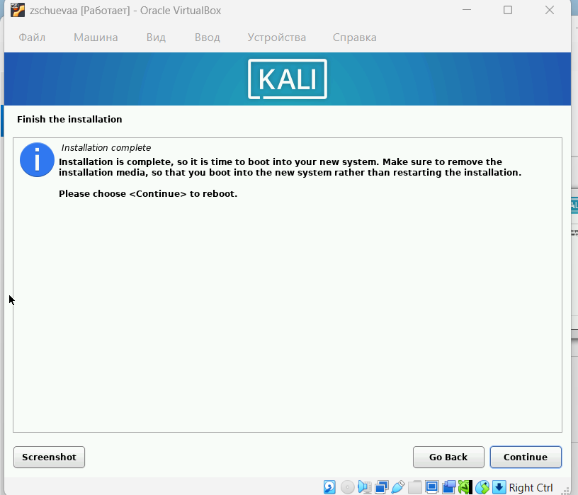{#fig:22 width=70%}

Перезагружаю систему и захожу в систему. 

{#fig:23 width=70%}

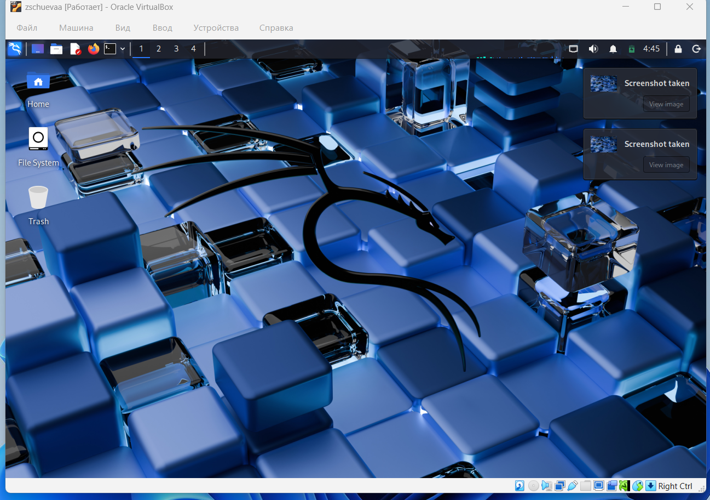{#fig:24 width=70%}

# Выводы

Получила навыки по установке ОС на менеджер виртуальных машин.
