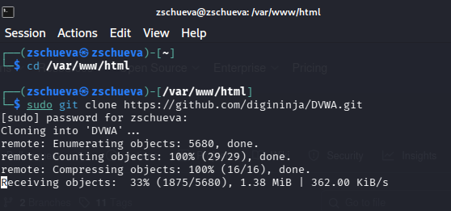
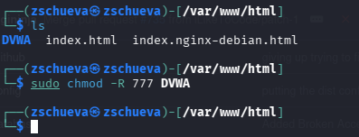
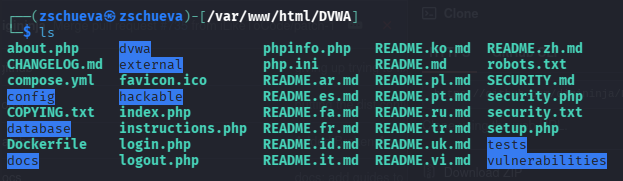
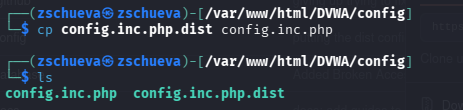
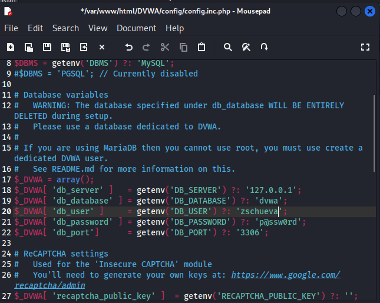
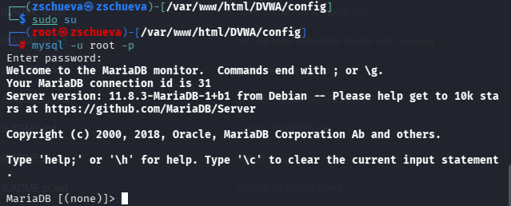
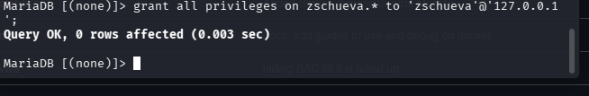
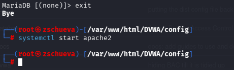
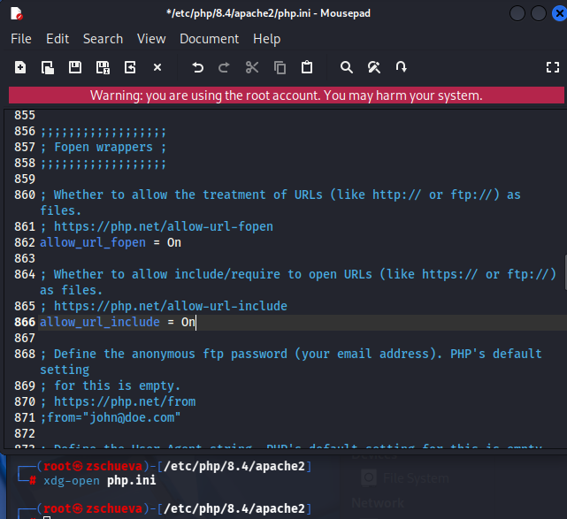
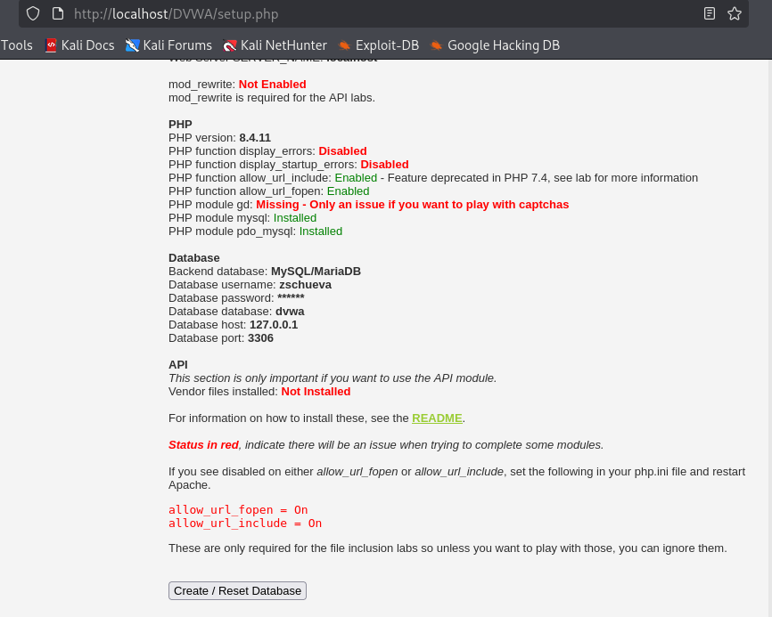

---
## Front matter
lang: ru-RU
title: Второй этап индивидуального проекта
subtitle: Установка DVWA
author:
  - Чуева З.
institute:
  - Российский университет дружбы народов, Москва, Россия
date: 21 марта 2026

## i18n babel
babel-lang: russian
babel-otherlangs: english

## Formatting pdf
toc: false
toc-title: Содержание
slide_level: 2
aspectratio: 169
section-titles: true
theme: metropolis
header-includes:
 - \metroset{progressbar=frametitle,sectionpage=progressbar,numbering=fraction}
---

# Информация

## Докладчик

:::::::::::::: {.columns align=center}
::: {.column width="70%"}

  * Чуева Злата
  * НБИбд 01-24
  * Факультет Физико-математических и естесвенных наук
  * Российский университет дружбы народов
  * [1132242459@rudn.ru](mailto:1132242459@rudn.ru)
  * <https://github.com/ZlataChueva>

:::
::: {.column width="30%"}
:::
::::::::::::::

# Цель работы

Получить практические навыки по установке DVWA.

# Задание

1. Установить DVWA.

# Выполнение лабораторной работы

Открою github и зайду в репозиторий dvwa, скопирую ссылку.

Открою терминал, и с помощью cd, вхожу в директорию html, где сохраняются файлы локального хоста. В этой же директории клонирую репозиторий.

{#fig:001 width=90%}

# Разрешение прав

С помощью ls поверяю, что клонирование было успешно и потом разрешаю все права на все файлы в DVWA используя chmod -R 777

{#fig:002 width=90%}

# Проверка клонирования 

Проверяю работу и захожу в dvwa/config, чтобы настроить веб-приложение.

{#fig:003 width=90%}

# Копирование конфигурации приложения

Далее копирую config.int.php который содержит конфигурацию приложения.

{#fig:004 width=90%}

# Редактирование файла конфигурации

В этом файле изменяю пароль, имя пользователя на  zschueva и сохраняю изменения.

{#fig:005 width=90%}

# Запуск mysq

Запускаю mysql с помощью start mysql и проверяю используя status mysql.

{#fig:006 width=90%}

# Вход в mysql

Далее вхожу в mmysql, используя mysql -u root -p 

{#fig:007 width=90%}

# Создание базы данных

Создаю базу данных zschueva и нового пользователя используя create user 'zschueva'@'127.0.0.1' identified by 'password'. Используя эту команду, создала пользователя zschueva, работаюшего на сервер локального хоста (127.0.0.1) и пароль password.

{#fig:008 width=90%}

# Разрешение прав

Разрешаю все права доступа этому пользователю к базе данных и завершаю работы.

{#fig:009 width=90%}

# Запуск сервера

Запускаю сервер apache2.

{#fig:0010 width=90%}

# /etc/php/8.4. 

Вхожу в /etc/php/8.4. 

{#fig:0011 width=90%}

# Включение  allow_url

Включаю значения allow_url_fopen и allow_url_include в файле apache2/php.ini.

{#fig:0012 width=90%}

# Перезапуск apache2

Перезапускаю сервер apache2 испоьзуя systemctl restart apache2. 

{#fig:0013 width=90%}

# Страница веб-приложения

Открою 127.0.0.1./dvwa/setup.php в браузере.   

{#fig:0014 width=90%}

Нажимаю кнопку create/Reset database. Создается база данных и меня перенаправляют на страницу входа. Вхожу используя логин admin и пароль p@ssword.

# Выводы

Получила навыки по установке DVWA.

# Список литературы{.unnumbered}

[Set up DVWA in Kali Linux][https://akshaygupta21.medium.com/how-to-setup-dvwa-in-kali-linux-e7c0dc272bba]