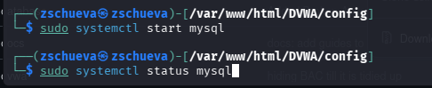
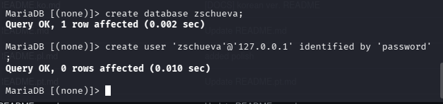
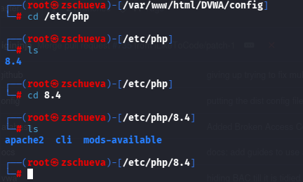
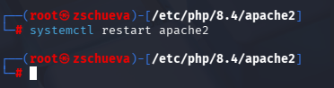

---
## Front matter
title: "Отчет по Второму Этапу Индивидуального Проекта "
subtitle: "Установка DVWA"
author: "Чуева Злата"

## Generic otions
lang: ru-RU
toc-title: "Содержание"

## Bibliography
bibliography: bib/cite.bib
csl: pandoc/csl/gost-r-7-0-5-2008-numeric.csl

## Pdf output format
toc: true # Table of contents
toc-depth: 2
lof: true # List of figures
lot: true # List of tables
fontsize: 12pt
linestretch: 1.5
papersize: a4
documentclass: scrreprt
## I18n polyglossia
polyglossia-lang:
  name: russian
  options:
	- spelling=modern
	- babelshorthands=true
polyglossia-otherlangs:
  name: english
## I18n babel
babel-lang: russian
babel-otherlangs: english
## Fonts
mainfont: Times New Roman
romanfont: Times New Roman
sansfont: Times New Roman
monofont: Times New Roman
mathfont: Times New Roman
mainfontoptions: Ligatures=Common,Ligatures=TeX,Scale=0.94
romanfontoptions: Ligatures=Common,Ligatures=TeX,Scale=0.94
sansfontoptions: Ligatures=Common,Ligatures=TeX,Scale=MatchLowercase,Scale=0.94
monofontoptions: Scale=MatchLowercase,Scale=0.94,FakeStretch=0.9
mathfontoptions:
## Biblatex
biblatex: true
biblio-style: "gost-numeric"
biblatexoptions:
  - parentracker=true
  - backend=biber
  - hyperref=auto
  - language=auto
  - autolang=other*
  - citestyle=gost-numeric
## Pandoc-crossref LaTeX customization
figureTitle: "Рис."
lofTitle: "Список иллюстраций"
## Misc options
indent: true
header-includes:
  - \usepackage{indentfirst}
  - \usepackage{float} # keep figures where there are in the text
  - \floatplacement{figure}{H} # keep figures where there are in the text
---

# Цель работы

Получить практические навыки по установке DVWA.

# Задание

1. Установить DVWA.

# Выполнение лабораторной работы

Открою github и захожу в репозиторий dvwa и копирую ссылку.

Открою терминал, и с помощью cd, вхожу в директорию html, где сохраняются файлы локального хоста. В этой же директории клонирую репозиторий.

{#fig:001 width=90%}

С помощью ls поверяю, что клонирование было успешно и потом разрешаю все права на все файлы в DVWA используя chmod -R 777

{#fig:002 width=90%}

Проверяю работу и захожу в dvwa/config, чтобы настроить веб-приложение.

{#fig:003 width=90%}

Далее копирую config.int.php который содержит конфигурацию приложения.

{#fig:004 width=90%}

В этом файле изменяю пароль, имя пользователя на  zschueva и сохраняю изменения.

{#fig:005 width=90%}

Запускаю mysql с помощью start mysql и проверяю используя status mysql.

{#fig:006 width=90%}

Далее вхожу в mmysql, используя mysql -u root -p 

{#fig:007 width=90%}

Создаю базу данных zschueva и нового пользователя используя create user 'zschueva'@'127.0.0.1' identified by 'password'. Используя эту команду, создала пользователя zschueva, работаюшего на сервер локального хоста (127.0.0.1) и пароль password.

{#fig:008 width=90%}

Разрешаю все права доступа этому пользователю к базе данных и завершаю работы.

{#fig:009 width=90%}

Запускаю сервер apache2.

{#fig:0010 width=90%}

Вхожу в /etc/php/8.4. 

{#fig:0011 width=90%}

Включаю значения allow_url_fopen и allow_url_include в файле apache2/php.ini.

{#fig:0012 width=90%}

Перезапускаю сервер apache2 испоьзуя systemctl restart apache2. 

{#fig:0013 width=90%}

Открою 127.0.0.1./dvwa/setup.php в браузере.   

{#fig:0014 width=90%}

Нажимаю кнопку create/Reset database. Создается база данных и меня перенаправляют на страницу входа. Вхожу используя логин admin и пароль p@ssword.

# Выводы

Получила навыки по установке DVWA.

# Список литературы{.unnumbered}

[Set up DVWA in Kali Linux][https://akshaygupta21.medium.com/how-to-setup-dvwa-in-kali-linux-e7c0dc272bba]
