---
## Front matter
title: "Отчёт по лабораторной работе №1"
subtitle: "Установка и Конфигурация ОС на Виртуальную Машину"
author: "Чуева Злата. НБИбд-01-24"

## Generic otions
lang: ru-RU
toc-title: "Содержание"

## Bibliography
bibliography: bib/cite.bib
csl: pandoc/csl/gost-r-7-0-5-2008-numeric.csl

## Pdf output format
toc: true # Table of contents
toc-depth: 2
lof: true # List of figures
fontsize: 13pt
linestretch: 1.5
papersize: a4
documentclass: scrreprt
## I18n polyglossia
polyglossia-lang:
  name: russian
  options:
	- spelling=modern
	- babelshorthands=true
polyglossia-otherlangs:
  name: english
## I18n babel
babel-lang: russian
babel-otherlangs: english
## Fonts
mainfont: Times New Roman
romanfont: Times New Roman
sansfont: Times New Roman
monofont: Times New Roman
mathfont: Times New Roman
mainfontoptions: Ligatures=Common,Ligatures=TeX,Scale=0.94
romanfontoptions: Ligatures=Common,Ligatures=TeX,Scale=0.94
sansfontoptions: Ligatures=Common,Ligatures=TeX,Scale=MatchLowercase,Scale=0.94
monofontoptions: Scale=MatchLowercase,Scale=0.94,FakeStretch=0.9
mathfontoptions:
## Biblatex
biblatex: true
biblio-style: "gost-numeric"
biblatexoptions:
  - parentracker=true
  - backend=biber
  - hyperref=auto
  - language=auto
  - autolang=other*
  - citestyle=gost-numeric
## Pandoc-crossref LaTeX customization
figureTitle: "Рис."
listingTitle: "Листинг"
lofTitle: "Список иллюстраций"
lolTitle: "Листинги"
## Misc options
indent: true
header-includes:
  - \usepackage{indentfirst}
  - \usepackage{float} # keep figures where there are in the text
  - \floatplacement{figure}{H} # keep figures where there are in the text
---

# Цель работы

Приобретение практических навыков установки операционной системы на виртуальную машину, настройки минимально необходимых для дальнейшей работы сервисов.

# Задание

1. Установить и настроить Rocky Linux.
2. Получить следующую информацию с помощью команд:
	1. Версия Linux
	2. Частота процессора
	3. Модель процессора
	4. Объем доступной оперативной памяти
	5. Тип обнаруженного гипервизора
	6. Тип файловой системы корневого раздела
	7. Последовательность монтирования файловых систем

# Выполнение лабораторной работы

В приложении VirtualBox создала новую виртуальную машину.

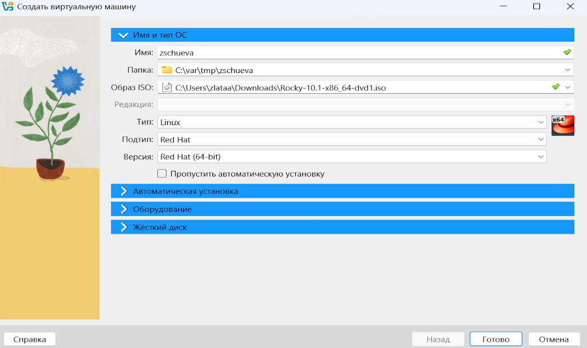{#fig:001 width=100%}

Указала объем памяти и добавила привод оптических дисков.

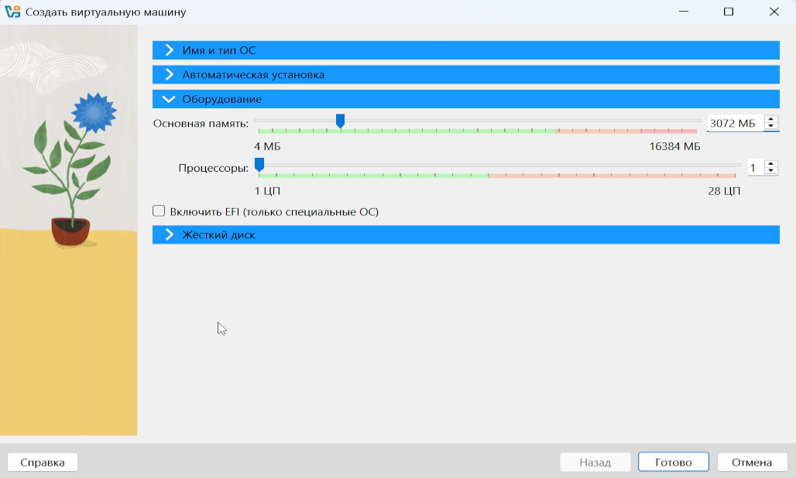{#fig:002 width=100%}

{#fig:003 width=100%}

Соглашаюсь с поставленными настройками.

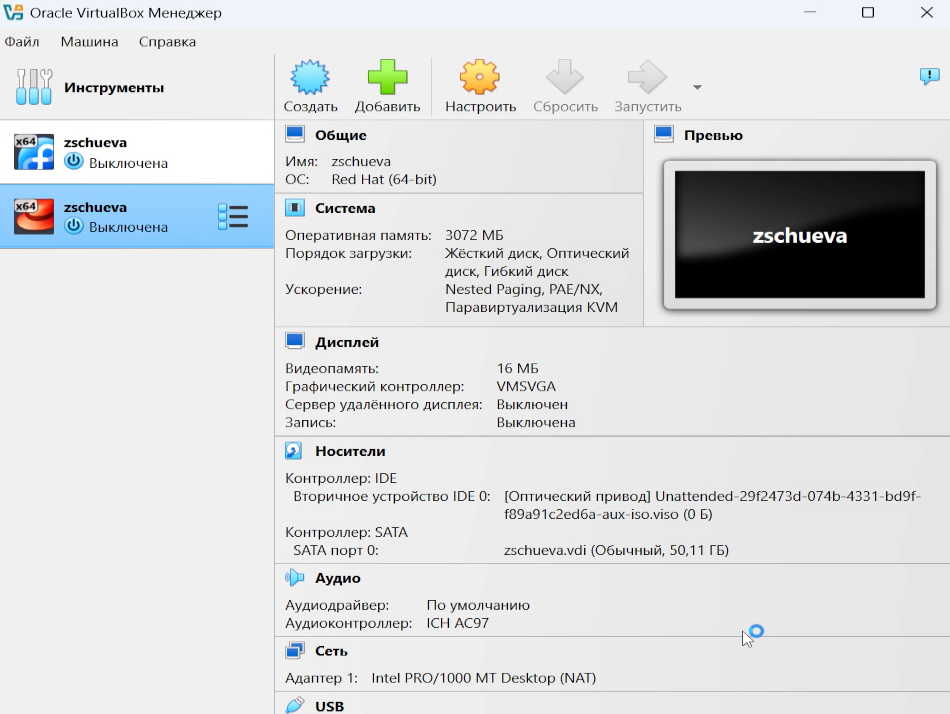{#fig:004 width=100%}

Привод оптических дисков.

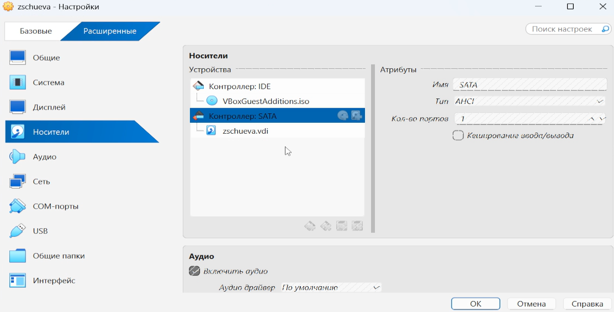{#fig:005 width=100%}

Запустила виртуальную машину.

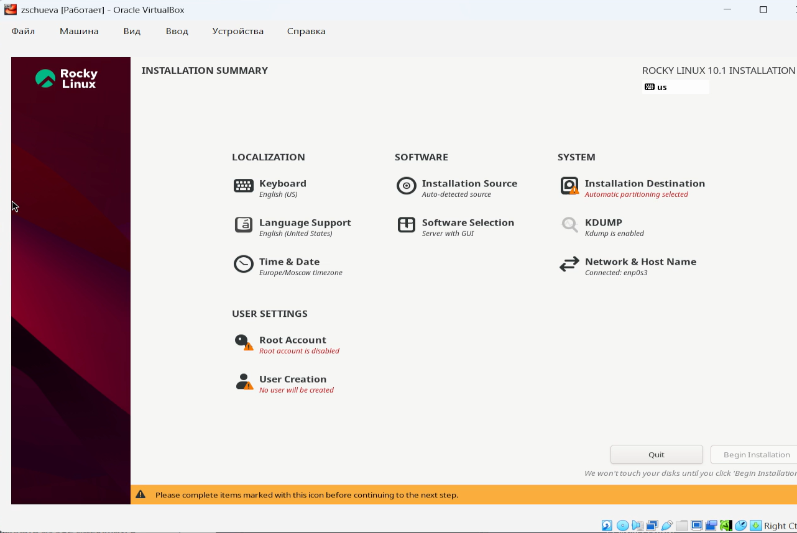{#fig:006 width=100%}

Выбирала язык установки.

{#fig:007 width=100%}

В качестве базового окружения выбрала Server with GUI, а в качестве дополнения — Development Tools. 

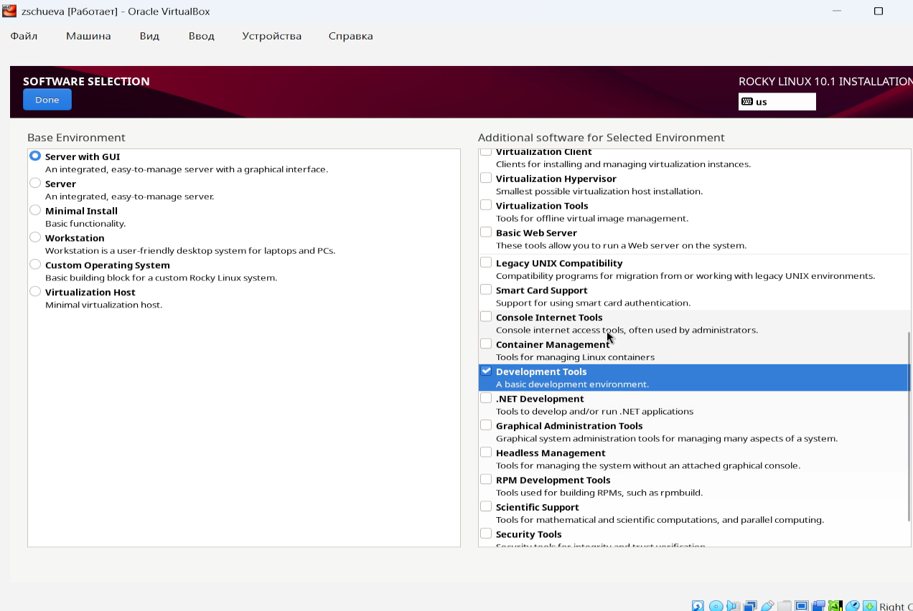{#fig:008 width=100%}

Отключила KDUMP.

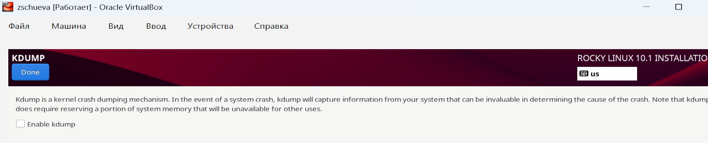{#fig:0011 width=100%}

Проверила место установки.

{#fig:009 width=100%}

Включила сетевое соединение и указала имя домена.

{#fig:0010 width=100%}

Указала пароль для root и пользователя с правами администратора

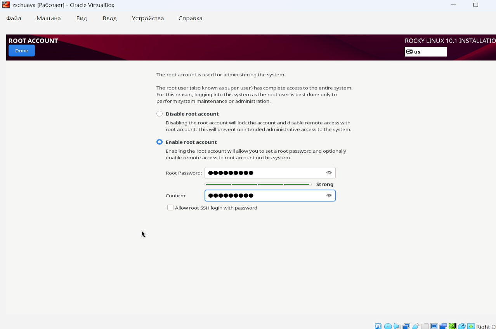{#fig:0012 width=100%}

{#fig:0012 width=100%}

Установила систему.
 
{#fig:0013 width=100%}

После завершения установки образ диска пропадет из носителей.

{#fig:0014 width=100%}

# Выполнение домашнего задания

Запустила в терминале: dmesg | grep -i "Linux version", чтобы получить информацию о ядре.

{#fig:0017 width=100%}

dmesg | grep -i "Detected", чтобы получить информацию о частоте процессора.

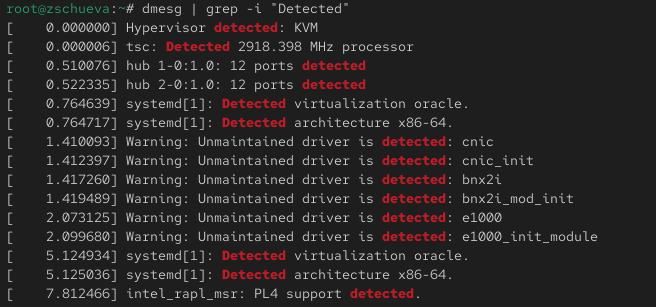{#fig:0018 width=100%}

dmesg | grep -i "CPU0", чтобы получить информацию о модели процессора.

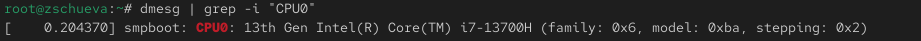{#fig:0019 width=100%}

dmesg | grep -i "Memory", чтобы получить информацию об оперативной памяти.

{#fig:0020 width=100%}

dmesg | grep -i "Hypervisor detected", чтобы получить информацию о гипервизоре.

{#fig:0021 width=100%}

lsblk -f, чтобы получить информацию о файловой системе корневого раздела.

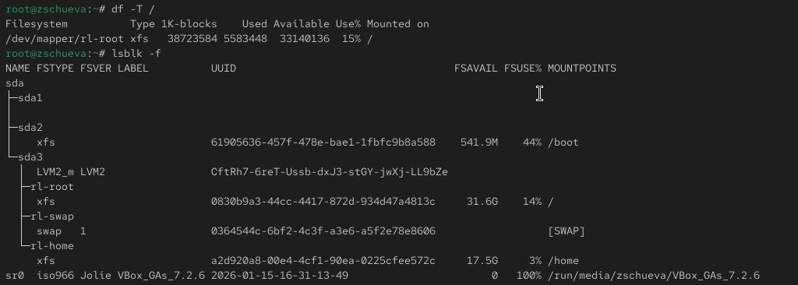{#fig:0022 width=100%}

dmesg | grep -i "mount", чтобы получить информацию о монтировании файловых систем.

{#fig:0023 width=100%}

# Ответы на контрольные вопросы

1. Учетная запись содержит необходимые для идентификации пользователя при подключении к системе данные, а так же информацию для авторизации и учета: системного имени (user name) (оно может содержать только латинские буквы и знак нижнее подчеркивание, еще оно должно быть уникальным), идентификатор пользователя (UID) (уникальный идентификатор пользователя в системе, целое положительное число), идентификатор группы (CID) (группа, к к-рой относится пользователь. Она, как минимум, одна, по умолчанию - одна), полное имя (full name) (Могут быть ФИО), домашний каталог (home directory) (каталог, в к-рый попадает пользователь после входа в систему и в к-ром хранятся его данные), начальная оболочка (login shell) (командная оболочка, к-рая запускается при входе в систему).

2. Для получения справки по команде: <команда> —help; для перемещения по файловой системе - cd; для просмотра содержимого каталога - ls; для определения объёма каталога - du <имя каталога>; для создания / удаления каталогов - mkdir/rmdir; для создания / удаления файлов - touch/rm; для задания определённых прав на файл / каталог - chmod; для просмотра истории команд - history

3. Файловая система - это порядок, определяющий способ организации и хранения и именования данных на различных носителях информации. Примеры: FAT32 представляет собой пространство, разделенное на три части: олна область для служебных структур, форма указателей в виде таблиц и зона для хранения самих файлов. ext3/ext4 - журналируемая файловая система, используемая в основном в ОС с ядром Linux.

4. С помощью команды df, введя ее в терминале. Это утилита, которая показывает список всех файловых систем по именам устройств, сообщает их размер и данные о памяти. Также посмотреть подмонтированные файловые системы можно с помощью утилиты mount.

5. Чтобы удалить зависший процесс, вначале мы должны узнать, какой у него id: используем команду ps. Далее в терминале вводим команду kill < id процесса >. Или можно использовать утилиту killall, что "убьет" все процессы, которые есть в данный момент, для этого не нужно знать id процесса. 

# Выводы

Я приобрела практические навыки установки операционной системы на виртуальную машину и настройки минимально необходимых для дальнейшей работы сервисов.

# Список литературы{.unnumbered}

::: 
:::
