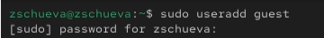
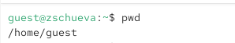
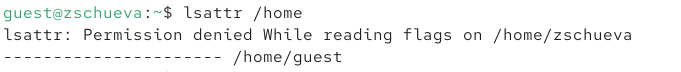
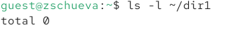
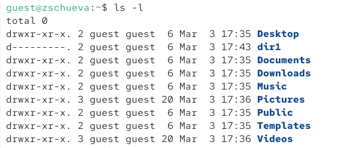
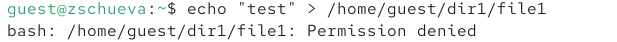
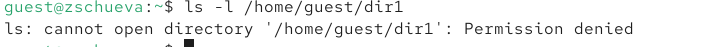

# Докладчик

:::::::::::::: {.columns align=center}
::: {.column width="70%"}

  * Чуева Злата
  * Физико-Математический факультет
  * Российский университет дружбы народов
  * [1132242459@rudn.ru](mailto:1132242459@rudn.ru)
  * <https://github.com/ZlataChueva>

:::
::::::::::::::

# Цель работы

Получение практических навыков работы в консоли с атрибутами файлов, закрепление теоретических основ дискреционного разграничения доступа в современных системах с открытым кодом на базе ОС Linux.

# Задание

1. Выполнить команды
2. Заполнить таблицы

# Выполнение лабораторной работы

Через учетную запись администратора создала нового пользователя guest и задала пароль.

{#fig:001 width=100%}

# Атрибуты файлов

{#fig:002 width=100%}

# Атрибуты файлов

Вошла в систему от имени ползователя guest и определила, где нахожусь с помощью команды pwd.

{#fig:003 width=100%}

# Атрибуты файлов

Уточнила имя пользователя.

{#fig:004 width=100%}

# Атрибуты файлов

Уточнила группу пользователя с помощью команд id и groups.

{#fig:005 width=100%}

# Атрибуты файлов

{#fig:006 width=100%}

# Атрибуты файлов

С помощью команды cat /etc/passwd вывела свою учетную запись и адрес домашней директории. 

{#fig:007 width=100%}

# Атрибуты файлов

Определила и сравнила uid и gid пользователей.

{#fig:008 width=100%}

# Атрибуты файлов

Определила существующие в системе директории с помощью команды ls -l /home/

{#fig:009 width=100%}

# Атрибуты файлов

Проверила, какие расширенные атрибуты установлены на поддиректориях, находящихся в директории /home, командой lsattr /home

{#fig:010 width=100%}

# Атрибуты файлов

Создала в домашней директории поддиректорию dir1 командой mkdir dir1

{#fig:011 width=100%}

# Атрибуты файлов

Определила командами ls -l и lsattr, какие права доступа и расширенные атрибуты были выставлены на директорию dir1.

{#fig:012 width=100%}

# Атрибуты файлов

Сняла с директории dir1 все атрибуты командой chmod 000 dir1 и проверила с её помощью правильность выполнения команды ls -l

{#fig:013 width=70%}

# Атрибуты файлов

{#fig:014 width=100%}

# Атрибуты файлов

Попыталась создать в директории dir1 файл file1 командой echo "test" > /home/guest/dir1/file1. Получила отказ в выполнении, так как на директорию dir1 были установлены полностью запрещающие права (для владельца, группы и остальных пользователей).

{#fig:015 width=100%}

# Атрибуты файлов

Проверила командой ls -l /home/guest/dir действительно ли файл file1 не находится внутри директории dir1.

{#fig:016 idth=100%}

# Выводы

Получила практических навыков работы в консоли с атрибутами файлов, закрепила теоретические основы дискреционного разграничения доступа в современных системах с открытым кодом на базе ОС Linux.

