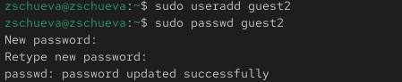
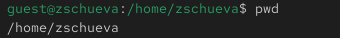
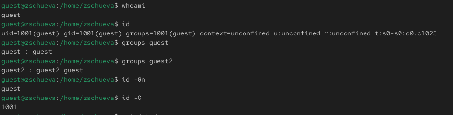
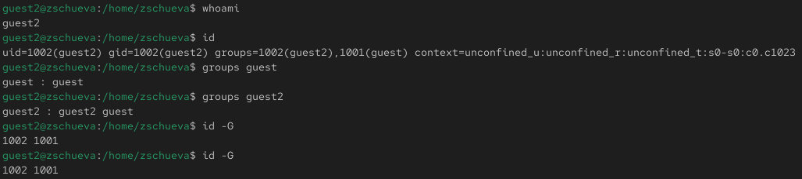
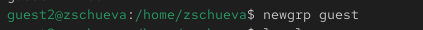
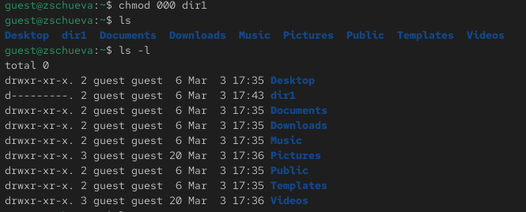

---
## Front matter
lang: ru-RU
title: Презентация по лабораторной работе №3
subtitle: Дискреционное разграничение прав в Linux. Два пользователя
author:
  - Чуева З.
institute:
  - Российский университет дружбы народов, Москва, Россия
date: 21 марта 2026

## i18n babel
babel-lang: russian
babel-otherlangs: english

## Formatting pdf
toc: false
toc-title: Содержание
slide_level: 2
aspectratio: 169
section-titles: true
theme: metropolis
header-includes:
 - \metroset{progressbar=frametitle,sectionpage=progressbar,numbering=fraction}
---

# Докладчик

:::::::::::::: {.columns align=center}
::: {.column width="70%"}

  * Чуева Злата
  * НБИбд-01-24
  * Факультет Физико-математических и естественных наук
  * Российский университет дружбы народов
  * [1132242459@rudn.ru](mailto:1132242459@rudn.ru)
  * <https://github.com/ZlataChueva>

:::
::::::::::::::

# Цель работы

Получение практических навыков работы в консоли с атрибутами файлов для групп пользователей.

# Задание

1. Выполнить задания лабораторной работы.

# Выполнение лабораторной работы

Из предыдущей лабораторной работы у меня уже создан пользователь guest. 

{#fig:001 width=90%}

# Создание guest2

Создаю пользователя guest2 и устанавливаю пароль. 

{#fig:002 width=90%}

# Добавление в группу

Добавляю guest2 в группу guest:

{#fig:003 width=90%}

# вход в guest

От имени guest и guest2 захожу на разных консолях используя su:

{#fig:004 width=90%}

# вход в guest2

{#fig:005 width=90%}

# 2 Консоли

{#fig:006 width=90%} 

# guest - pwd

С помощью команды pwd определяю, где нахожусь:

{#fig:007 width=90%}

# gues2t - pwd

{#fig:008 width=90%}

# Проверка guest

Текущая директория совпадает с приглашением командной строки. 

Проверяю имя пользователей с помощью команды whoami. Она выводит группы, которым принадлежит пользователь и коды этих групп. 
Команда groups просто выведет список групп, в которые входит пользователь.
id -Gn - выведет названия групп, которым принадлежит пользователь
id -G - выведет только код групп, которым принадлежит пользователь.

{#fig:009 width=90%}

# Проверка guest2

{#fig:0010 width=90%}

# содержиемое etc/group

Вывожу содержимое файла etc/group у обоих пользователей. 

{#fig:0011 width=90%}

# создание новой группы

Регистрирую guest2 в группе guest с помощью команды newgrp:

{#fig:0012 width=90%}

# вход в /home/guest

Вхожу в директорию /home/guest. 

{#fig:0013 width=90%}

# Изменение прав доступа

Разрешаю все действия для пользователей группы.

{#fig:0014 width=90%}

# Проверка изменений

Снимаю все атрибуты с директории dir1, созданной в предыдущей лабораторной работе. Проверяю, что права действительно сняты.

{#fig:0015 width=90%}

# Проверка

{#fig:0016 width=90%}

# Проверка атрибутов

Проверяю как guest2 взаимодействует с файлами dir1 и заполняю таблицы.

{#fig:0017 width=90%}

# Выводы

Получила навыки работы в консоли с атрибутами файлов.
